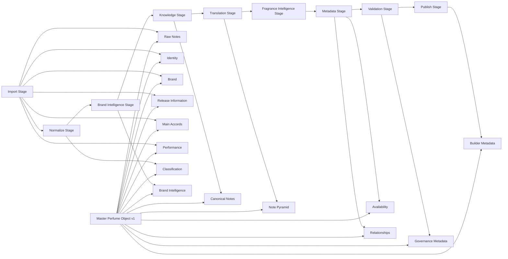

# Canonical Master Perfume Object v1

## Purpose
Define the canonical fact-only object contract that every Builder-generated fragrance must satisfy before any Fragrance Intelligence is generated.

## Scope
Architecture only.

No runtime behavior, recommendation logic, translation rule implementation, metadata enrichment implementation, or Builder code behavior is changed by this document.

## Mandatory Principle
The Master Perfume Object contains facts only.

The object must not contain:
1. recommendations
2. compatibility scores
3. user-specific attributes
4. DNA axes
5. semantic vectors
6. explainability narratives

Those concerns belong to Fragrance Intelligence and are out of scope.

## Canonical Top-Level Domains
1. Identity
2. Brand
3. Classification
4. Release Information
5. Raw Notes
6. Canonical Notes
7. Note Pyramid
8. Main Accords
9. Performance
10. Availability
11. Relationships
12. Brand Intelligence
13. Builder Metadata
14. Governance Metadata

## Architecture Diagram


## Domain Ownership
Each domain has exactly one owner.

| Domain | Owner |
|---|---|
| Identity | Builder Import Domain Owner |
| Brand | Builder Import Domain Owner |
| Classification | Builder Normalize Domain Owner |
| Release Information | Builder Import Domain Owner |
| Raw Notes | Builder Import Domain Owner |
| Canonical Notes | Builder Knowledge Domain Owner |
| Note Pyramid | Builder Translation Domain Owner |
| Main Accords | Builder Import Domain Owner |
| Performance | Builder Import Domain Owner |
| Availability | Builder Metadata Domain Owner |
| Relationships | Builder Metadata Domain Owner |
| Brand Intelligence | Builder Brand Intelligence Domain Owner |
| Builder Metadata | Builder Publish Domain Owner |
| Governance Metadata | Builder Validation Domain Owner |

## Canonical Contract
```yaml
masterPerfumeObjectV1:
  identity: {}
  brand: {}
  classification: {}
  releaseInformation: {}
  rawNotes: {}
  canonicalNotes: {}
  notePyramid: {}
  mainAccords: {}
  performance: {}
  availability: {}
  relationships: {}
  brandIntelligence: {}
  builderMetadata: {}
  governanceMetadata: {}
```

## Property Specification

### 1. Identity
Owner: Builder Import Domain Owner

| Property | Description | Data Type | Required | Producer | Consumers | Source | Deterministic / Inferred | Builder Stage | Validation Rules | Future Extensibility |
|---|---|---|---|---|---|---|---|---|---|---|
| identity.fragranceId | Stable canonical fragrance identifier | string | Required | Import stage | All downstream Builder stages, Fragrance Intelligence | Raw database id or deterministic import id | Deterministic | import | Non-empty, stable, unique in output set | Can support alternate source keys in identity.aliases |
| identity.sourceRecordKey | Pointer to raw imported row identity | string | Required | Import stage | Validation, Governance | Raw import row key | Deterministic | import | Must map to exactly one raw row | Can include worksheet-qualified keys |
| identity.displayName | Canonical display perfume name as fact | string | Required | Import stage | UI, Search, Fragrance Intelligence | Raw perfume field | Deterministic | import | Non-empty trimmed string | Locale variants may be added as sibling fields |
| identity.slug | Deterministic machine-safe name key | string | Optional | Normalize stage | Search indexing, linking | identity.displayName | Deterministic | normalize | Lowercase URL-safe, reproducible transform | Multi-locale slug set may be added |
| identity.aliases | Known factual naming variants | string[] | Optional | Normalize stage | Matching and dedupe workflows | Raw name variants from source | Deterministic | normalize | Must not include empty strings | Alias provenance per item can be appended |

### 2. Brand
Owner: Builder Import Domain Owner

| Property | Description | Data Type | Required | Producer | Consumers | Source | Deterministic / Inferred | Builder Stage | Validation Rules | Future Extensibility |
|---|---|---|---|---|---|---|---|---|---|---|
| brand.brandNameRaw | Source brand name exactly as imported | string | Required | Import stage | Normalize, Brand Intelligence | Raw brand field | Deterministic | import | Non-empty string | Can be joined with source locale metadata |
| brand.brandNameCanonical | Canonical brand form used in contract | string | Required | Normalize stage | Brand Intelligence, Metadata | brand.brandNameRaw | Deterministic | normalize | Non-empty normalized form | Can support canonical name versioning |
| brand.brandId | Deterministic brand identifier | string | Required | Normalize stage | Brand Intelligence, Relationships | Canonical brand mapping | Deterministic | normalize | Stable and unique among brands | Brand registry linkage can be added |
| brand.brandAliases | Known factual brand aliases | string[] | Optional | Normalize stage | Matching, governance review | Source variants | Deterministic | normalize | Unique non-empty entries | Alias provenance can be added |

### 3. Classification
Owner: Builder Normalize Domain Owner

| Property | Description | Data Type | Required | Producer | Consumers | Source | Deterministic / Inferred | Builder Stage | Validation Rules | Future Extensibility |
|---|---|---|---|---|---|---|---|---|---|---|
| classification.objectType | Object category, fixed to fragrance | string | Required | Normalize stage | Validation, Consumers | Builder contract | Deterministic | normalize | Must equal "fragrance" | Additional object types can be versioned later |
| classification.concentrationRaw | Source concentration value as fact | string | Optional | Import stage | Normalize, Metadata | Raw source | Deterministic | import | Preserve exact source text | Structured concentration metadata can be added |
| classification.concentrationCanonical | Canonical concentration label | string | Optional | Normalize stage | Metadata, Search | classification.concentrationRaw | Deterministic | normalize | Must belong to canonical enumeration when present | Enumeration can expand with governance approval |
| classification.genderRaw | Source gender marker | string | Optional | Import stage | Normalize, Metadata | Raw source | Deterministic | import | Preserve exact source text | Locale-aware labels can be added |
| classification.genderCanonical | Canonical gender category | string | Optional | Normalize stage | Metadata, Search | classification.genderRaw | Deterministic | normalize | Must match canonical category set when present | Multi-axis gender taxonomy can be added |

### 4. Release Information
Owner: Builder Import Domain Owner

| Property | Description | Data Type | Required | Producer | Consumers | Source | Deterministic / Inferred | Builder Stage | Validation Rules | Future Extensibility |
|---|---|---|---|---|---|---|---|---|---|---|
| releaseInformation.launchYearRaw | Source launch year as imported | string | Optional | Import stage | Normalize, governance | Raw launch_year field | Deterministic | import | Preserve source exactly | Typed year can be added in parallel |
| releaseInformation.launchYear | Canonical launch year | number | Optional | Normalize stage | Metadata, filtering | releaseInformation.launchYearRaw | Deterministic | normalize | Integer in accepted year range | Approximate year model can be added |
| releaseInformation.releaseCountryRaw | Source country text | string | Optional | Import stage | Normalize, metadata | Raw source | Deterministic | import | Preserve source exactly | ISO-country mapping can be added |
| releaseInformation.releaseCountryCanonical | Canonical country code or label | string | Optional | Normalize stage | Metadata, search | releaseInformation.releaseCountryRaw | Deterministic | normalize | Must match canonical country table when present | Region hierarchy can be added |

### 5. Raw Notes
Owner: Builder Import Domain Owner

| Property | Description | Data Type | Required | Producer | Consumers | Source | Deterministic / Inferred | Builder Stage | Validation Rules | Future Extensibility |
|---|---|---|---|---|---|---|---|---|---|---|
| rawNotes.sourceValue | Raw notes payload exactly as imported | unknown | Required | Import stage | Translation, governance | Raw notes field | Deterministic | import | Must remain byte-equivalent at serialization boundary | Additional raw snapshots can be attached |
| rawNotes.detectedStructure | Detected source notes structure | string | Required | Import stage | Translation, validation | Parsed raw notes | Deterministic | import | Must be one of supported structures | New structures can be added without breaking older ones |
| rawNotes.preservedStructure | Structure-preserving parsed form | object | Required | Import stage | Translation, validation | Raw notes source value | Deterministic | import | Must preserve all source elements | Can include parser provenance |
| rawNotes.entries | Deterministic flattened entry list with positions | object[] | Required | Import stage | Knowledge, Translation | rawNotes.preservedStructure | Deterministic | import | No dropped entries; position fields required when available | Additional positional dimensions can be added |
| rawNotes.structureVersion | Parser structure schema version | string | Required | Import stage | Validation, governance | Builder parser contract | Deterministic | import | Semantic version format required | Backward compatible schema evolution |

### 6. Canonical Notes
Owner: Builder Knowledge Domain Owner

| Property | Description | Data Type | Required | Producer | Consumers | Source | Deterministic / Inferred | Builder Stage | Validation Rules | Future Extensibility |
|---|---|---|---|---|---|---|---|---|---|---|
| canonicalNotes.items | Canonical note entries resolved from knowledge base | object[] | Required | Knowledge stage | Translation, Metadata | rawNotes.entries + knowledge repository | Deterministic | knowledge | Every item must reference a canonical note id | Additional evidence fields can be attached |
| canonicalNotes.items[].noteId | Canonical note identifier | string | Required | Knowledge stage | Translation, Metadata | Knowledge base | Deterministic | knowledge | Must exist in knowledge note registry | Support cross-taxonomy ids |
| canonicalNotes.items[].sourceText | Original source note text | string | Required | Knowledge stage | Governance, explainability boundary | Raw notes entry | Deterministic | knowledge | Must equal raw source token | Locale tags can be appended |
| canonicalNotes.items[].matchMethod | Matching method used | string | Required | Knowledge stage | Governance, validation | Knowledge matching pipeline | Deterministic | knowledge | Must be enumerated method | Confidence metadata can be added |
| canonicalNotes.unresolvedSourceNotes | Source notes not matched canonically | string[] | Optional | Knowledge stage | Governance review | rawNotes.entries | Deterministic | knowledge | Must preserve source text exactly | Review state lifecycle can be added |

### 7. Note Pyramid
Owner: Builder Translation Domain Owner

| Property | Description | Data Type | Required | Producer | Consumers | Source | Deterministic / Inferred | Builder Stage | Validation Rules | Future Extensibility |
|---|---|---|---|---|---|---|---|---|---|---|
| notePyramid.rawStructureType | Source pyramid organization type | string | Required | Translation stage | Metadata, governance | rawNotes.detectedStructure | Deterministic | translation | Must align with raw notes structure | New structural types can be appended |
| notePyramid.top | Canonical top-layer notes | string[] | Optional | Translation stage | UI, metadata consumers | canonicalNotes.items | Deterministic | translation | Unique ids/text within layer | Layer confidence can be added |
| notePyramid.middle | Canonical middle-layer notes | string[] | Optional | Translation stage | UI, metadata consumers | canonicalNotes.items | Deterministic | translation | Unique ids/text within layer | Layer provenance can be added |
| notePyramid.base | Canonical base-layer notes | string[] | Optional | Translation stage | UI, metadata consumers | canonicalNotes.items | Deterministic | translation | Unique ids/text within layer | Support additional layers |
| notePyramid.unlayered | Canonical notes without factual layer position | string[] | Optional | Translation stage | Metadata, governance | canonicalNotes.items | Deterministic | translation | Must include only unresolved-layer notes | Future resolved-layer promotion tracking |

### 8. Main Accords
Owner: Builder Import Domain Owner

| Property | Description | Data Type | Required | Producer | Consumers | Source | Deterministic / Inferred | Builder Stage | Validation Rules | Future Extensibility |
|---|---|---|---|---|---|---|---|---|---|---|
| mainAccords.sourceValue | Raw accords payload as imported | unknown | Required | Import stage | Normalize, metadata | Raw main_accords field | Deterministic | import | Preserve exact source value | Raw snapshots by source can be added |
| mainAccords.detectedStructure | Detected accords source structure | string | Required | Import stage | Normalize, validation | Parser output | Deterministic | import | Must be enumerated structure type | New structures can be added |
| mainAccords.entries | Deterministic accord entries in source order | object[] | Required | Import stage | Metadata, validation | Parsed source accords | Deterministic | import | Must preserve source order and text | Can include layer or weight when factual |
| mainAccords.entries[].value | Accord text | string | Required | Import stage | Metadata, governance | Source accords | Deterministic | import | Non-empty | Locale/alias metadata can be added |
| mainAccords.entries[].position | Accord position index in source | number | Required | Import stage | Validation | Source accord order | Deterministic | import | Zero-based integer sequence without gaps | Multi-dimensional position can be added |

### 9. Performance
Owner: Builder Import Domain Owner

| Property | Description | Data Type | Required | Producer | Consumers | Source | Deterministic / Inferred | Builder Stage | Validation Rules | Future Extensibility |
|---|---|---|---|---|---|---|---|---|---|---|
| performance.longevityRaw | Source longevity payload | unknown | Optional | Import stage | Metadata, governance | Raw longevity field | Deterministic | import | Preserve exact source value | Structured longevity subfields can be added |
| performance.sillageRaw | Source sillage payload | unknown | Optional | Import stage | Metadata, governance | Raw sillage field | Deterministic | import | Preserve exact source value | Structured sillage subfields can be added |
| performance.longevityCanonical | Canonical longevity category | string | Optional | Metadata stage | Filtering and display | performance.longevityRaw | Deterministic | metadata | Must match canonical category set when present | Expanded scales possible |
| performance.sillageCanonical | Canonical sillage category | string | Optional | Metadata stage | Filtering and display | performance.sillageRaw | Deterministic | metadata | Must match canonical category set when present | Expanded scales possible |

### 10. Availability
Owner: Builder Metadata Domain Owner

| Property | Description | Data Type | Required | Producer | Consumers | Source | Deterministic / Inferred | Builder Stage | Validation Rules | Future Extensibility |
|---|---|---|---|---|---|---|---|---|---|---|
| availability.status | Availability lifecycle status | string | Optional | Metadata stage | Search, display | Source metadata channels | Deterministic | metadata | Must match enum (active, discontinued, limited, unknown) | Regional status support |
| availability.regions | Regions where product is available | string[] | Optional | Metadata stage | Search and filtering | Source metadata channels | Deterministic | metadata | Unique non-empty codes | Region hierarchy support |
| availability.discontinued | Explicit discontinued flag | boolean | Optional | Metadata stage | UI, filtering | Source metadata channels | Deterministic | metadata | Boolean only | Discontinued timeline support |
| availability.lastVerifiedAt | Last factual verification timestamp | string | Optional | Metadata stage | Governance | Metadata verification stream | Deterministic | metadata | ISO-8601 timestamp | Multi-source verification logs |

### 11. Relationships
Owner: Builder Metadata Domain Owner

| Property | Description | Data Type | Required | Producer | Consumers | Source | Deterministic / Inferred | Builder Stage | Validation Rules | Future Extensibility |
|---|---|---|---|---|---|---|---|---|---|---|
| relationships.flankers | Related fragrance ids marked as flankers | string[] | Optional | Metadata stage | Navigation, governance | Source relationship data | Deterministic | metadata | No self references; ids must exist | Relationship confidence can be added |
| relationships.predecessors | Previous editions ids | string[] | Optional | Metadata stage | Navigation | Source relationship data | Deterministic | metadata | Id referential integrity required | Temporal ordering metadata can be added |
| relationships.successors | Successor editions ids | string[] | Optional | Metadata stage | Navigation | Source relationship data | Deterministic | metadata | Id referential integrity required | Temporal ordering metadata can be added |
| relationships.relatedVariants | Other factual variants ids | string[] | Optional | Metadata stage | Navigation | Source relationship data | Deterministic | metadata | Id referential integrity required | Typed variant relations can be added |

### 12. Brand Intelligence
Owner: Builder Brand Intelligence Domain Owner

| Property | Description | Data Type | Required | Producer | Consumers | Source | Deterministic / Inferred | Builder Stage | Validation Rules | Future Extensibility |
|---|---|---|---|---|---|---|---|---|---|---|
| brandIntelligence.brandTier | Canonical factual brand tier | string | Optional | Brand Intelligence stage | Metadata, filtering | Brand intelligence dataset | Deterministic | brand-intelligence | Must match canonical tier enum when present | Tier taxonomy evolution supported |
| brandIntelligence.brandOrigin | Factual origin marker for brand | string | Optional | Brand Intelligence stage | Metadata | Brand intelligence dataset | Deterministic | brand-intelligence | Must match controlled set | Country hierarchy support |
| brandIntelligence.brandPortfolioTags | Factual portfolio descriptors | string[] | Optional | Brand Intelligence stage | Metadata and display | Brand intelligence dataset | Deterministic | brand-intelligence | Unique tags | Tag namespaces can be added |
| brandIntelligence.provenance | Source provenance for brand intelligence facts | object | Required | Brand Intelligence stage | Governance, validation | Brand intelligence ingestion | Deterministic | brand-intelligence | Must include source + version + timestamp | Multi-source provenance chain support |

### 13. Builder Metadata
Owner: Builder Publish Domain Owner

| Property | Description | Data Type | Required | Producer | Consumers | Source | Deterministic / Inferred | Builder Stage | Validation Rules | Future Extensibility |
|---|---|---|---|---|---|---|---|---|---|---|
| builderMetadata.objectVersion | Master object schema version | string | Required | Publish stage | All consumers | Builder release config | Deterministic | publish | Semantic version required | Version compatibility policy |
| builderMetadata.pipelineVersion | Builder pipeline version used | string | Required | Publish stage | Governance and debugging | Builder pipeline runtime | Deterministic | publish | Must match pipeline release version | Build provenance chaining |
| builderMetadata.generatedAt | Object generation timestamp | string | Required | Publish stage | Governance | Builder runtime | Deterministic | publish | ISO-8601 timestamp | Multi-run history support |
| builderMetadata.generatedBy | Generator identity | string | Required | Publish stage | Governance | Builder runtime | Deterministic | publish | Non-empty tool identity | Signed generator identity |
| builderMetadata.sourceArtifacts | Parent artifact references | string[] | Required | Publish stage | Governance, traceability | Stage artifact lineage | Deterministic | publish | Referential integrity to artifact ids | Rich lineage graph support |

### 14. Governance Metadata
Owner: Builder Validation Domain Owner

| Property | Description | Data Type | Required | Producer | Consumers | Source | Deterministic / Inferred | Builder Stage | Validation Rules | Future Extensibility |
|---|---|---|---|---|---|---|---|---|---|---|
| governanceMetadata.contractStatus | Contract compliance outcome | string | Required | Validation stage | Publish, governance | Validation checks | Deterministic | validation | Must be pass/warn/fail | Detailed policy states can be added |
| governanceMetadata.validationErrors | Blocking validation errors | string[] | Optional | Validation stage | Governance, CI | Validation checks | Deterministic | validation | Empty when contractStatus is pass | Structured error codes can be added |
| governanceMetadata.validationWarnings | Non-blocking issues | string[] | Optional | Validation stage | Governance, CI | Validation checks | Deterministic | validation | Optional but explicit list | Warning severities can be added |
| governanceMetadata.provenance | Validation provenance metadata | object | Required | Validation stage | Audit and compliance | Validation runtime | Deterministic | validation | Must include validator version and timestamp | Signatures and attestations can be added |
| governanceMetadata.dataLineageHash | Deterministic lineage checksum | string | Optional | Validation stage | Audit and integrity checks | Object + artifact lineage | Deterministic | validation | Stable hash algorithm required | Multiple hashing algorithms support |

## Dependency Rules
1. Import is the factual ingress stage and may not depend on downstream stages.
2. Normalize may depend only on Import output.
3. Brand Intelligence may depend on Normalize output and external brand datasets, but must not depend on Metadata stage output.
4. Knowledge may depend on Brand Intelligence output.
5. Translation may depend on Knowledge output.
6. Metadata may consume Translation output and external factual metadata channels.
7. Validation may consume Metadata output and all upstream contract artifacts.
8. Publish may consume Validation output only.
9. Fragrance Intelligence consumes completed Master Perfume Object; it is never part of Master Perfume Object domains.

## Object Lifecycle
1. Import: ingest raw factual fields into Identity, Brand, Release Information, Raw Notes, Main Accords, Performance raw payloads.
2. Normalize: canonicalize deterministic identifiers and classification fields.
3. Brand Intelligence: attach factual brand-level intelligence properties.
4. Knowledge: resolve canonical note identities from raw note tokens.
5. Translation: organize canonical notes into deterministic pyramid representation.
6. Metadata: attach factual availability and relationship facts, and canonical performance labels.
7. Validation: evaluate contract completeness, consistency, and governance metadata.
8. Publish: emit finalized Master Perfume Object with builder metadata and lineage.

## Builder Stage Ownership Matrix
| Domain | Primary Stage |
|---|---|
| Identity | import |
| Brand | import / normalize (brand canonicalization) |
| Classification | normalize |
| Release Information | import / normalize |
| Raw Notes | import |
| Canonical Notes | knowledge |
| Note Pyramid | translation |
| Main Accords | import |
| Performance | import / metadata |
| Availability | metadata |
| Relationships | metadata |
| Brand Intelligence | brand-intelligence |
| Builder Metadata | publish |
| Governance Metadata | validation |

## Property Dependency Matrix
| Domain | Depends On |
|---|---|
| Identity | Raw Import source |
| Brand | Identity, Raw Import source |
| Classification | Identity, Brand |
| Release Information | Raw Import source |
| Raw Notes | Raw Import source |
| Canonical Notes | Raw Notes, Brand Intelligence, Knowledge repository |
| Note Pyramid | Canonical Notes, Raw Notes structure metadata |
| Main Accords | Raw Import source |
| Performance | Raw Import source, Metadata source channels |
| Availability | Translation output, Metadata source channels |
| Relationships | Metadata source channels, Identity registry |
| Brand Intelligence | Brand domain, Brand intelligence datasets |
| Builder Metadata | Full validated artifact lineage |
| Governance Metadata | All contract domains via validation outputs |

## Readiness Assessment
1. Identity and raw factual domains are implementation-ready.
2. Dual raw notes structure support enables deterministic downstream handling without source loss.
3. Canonical Notes and Note Pyramid domains are contract-ready and require stage-level implementation hardening in future milestones.
4. Governance metadata and builder metadata are contract-ready for auditability.
5. No out-of-scope Fragrance Intelligence fields are included.

Readiness status: Architecture contract ready for implementation alignment.

## Open Questions
1. Which canonical enumeration source will be authoritative for concentration and gender canonical sets?
2. Should note pyramid permit additional factual layers beyond top/middle/base in v1.x?
3. Which external factual metadata channels are approved as authoritative for availability and relationships?
4. What is the formal compatibility policy between objectVersion and pipelineVersion?