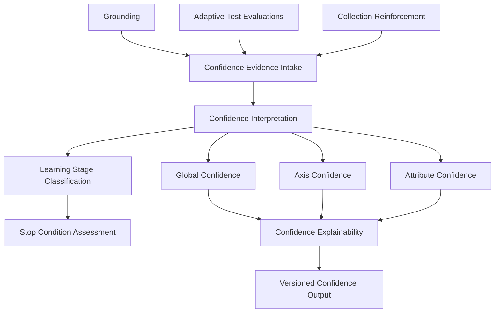

# Confidence Engine

## Purpose
Define the canonical architecture and contract for how FragranceDNA estimates confidence in Persistent User DNA understanding.

## Owner
User Intelligence Team.

## Dependencies
PRODUCT_DOCTRINE.md, ARCHITECTURE_PRINCIPLES.md, CANONICAL_ARCHITECTURE_V2.md, USER_DNA_MODEL.md, LEARNING_MODEL.md, TEST_ENGINE_V2.md, EXPLAINABILITY.md, ENGINE_VERSIONING.md.

## Canonical Responsibility
Estimate how well FragranceDNA understands the user's Persistent Olfactory DNA.

Confidence measures confidence in the model's understanding, not user activity volume.

## Mission
Confidence Engine has one responsibility only:
estimate confidence quality for Persistent User DNA understanding.

Confidence Engine does not perform recommendation logic, ranking logic, question selection logic, or DNA fusion logic.
It consumes canonical learning evidence and produces canonical confidence outputs.

## Responsibilities
1. Consume confidence-relevant evidence from canonical learning sources.
2. Maintain confidence semantics across global, axis, and attribute surfaces.
3. Reflect profile maturity through conceptual learning stages.
4. Support adaptive stop decisions based on confidence growth and information gain.
5. Preserve explainability and reproducibility for all confidence outputs.
6. Preserve stability by preventing time-based confidence decay.

## Canonical Inputs
Confidence Engine consumes only confidence-relevant evidence from canonical learning sources.
No additional learning sources are allowed in this contract.

### 1. Grounding
Grounding provides declared-preference prior evidence used as initial confidence anchor context.

### 2. Adaptive Test Evaluations
Adaptive Test evaluations provide primary discovery evidence for confidence growth during active profile discovery.

### 3. Collection Reinforcement
Collection Reinforcement provides optional long-term post-test evidence using the same canonical attribute-based evaluation methodology as Adaptive Test.

### Input Boundary Rule
Confidence must not be increased by non-learning interaction telemetry.

The following do not increase confidence:
1. Recommendation interactions
2. Recommendation impressions
3. Browsing behavior
4. Clicks
5. Searches
6. Non-evaluative engagement signals

## Canonical Outputs
Confidence Engine produces confidence outputs only.
This document defines conceptual outputs, not formulas.

### 1. Global Confidence
Global Confidence represents overall confidence in the current quality and reliability of the user's persistent olfactory profile.

### 2. Axis Confidence
Axis Confidence represents confidence by profile axis or equivalent canonical profile dimension.

### 3. Attribute Confidence
Attribute Confidence represents confidence by canonical attribute-level preference understanding.

## Learning Stages
Confidence stages represent profile maturity, not raw count of evaluated fragrances.

### 1. Discovery
Early confidence-building stage where the system is still forming initial reliable understanding of the user's profile.

### 2. Refinement
Intermediate stage where major preference structure exists and confidence improves through targeted clarification.

### 3. Validation
Stage where confidence quality is stress-checked and contradictions are resolved for profile reliability.

### 4. Maintenance
Stage where confidence is generally strong and future changes are incremental, primarily through Collection Reinforcement evidence.

## Stop Conditions
Confidence growth quality is more important than raw evaluation count.

### Canonical Stopping Philosophy
1. Adaptive Test should normally reach sufficiently reliable profile understanding within approximately 5–8 evaluated fragrances.
2. Stop decisions should be confidence-driven, not quota-driven.
3. Adaptive Test should stop when additional evaluations provide minimal information gain.
4. If confidence growth stalls and marginal evidence value is low, further forced evaluations are not required.

## Collection Reinforcement
Collection Reinforcement is the only long-term mechanism through which Persistent User DNA and confidence may continue to evolve after Adaptive Test completion.

### Collection Reinforcement Rules
1. Collection evaluations must use the same canonical attribute-based evaluation model as Adaptive Test.
2. Collection Reinforcement contributes additional confidence evidence through the same canonical learning pipeline.
3. Collection Reinforcement does not introduce alternative confidence semantics.
4. No other post-test learning sources are introduced in this contract.

## Confidence Stability
Confidence must be evidence-driven.

### Stability Rules
1. Confidence must not decay automatically over time.
2. Time alone must never reduce confidence.
3. Confidence may change only when new evidence changes model understanding of Persistent User DNA.
4. Confidence updates may increase, flatten, or decrease only in response to evidence, not chronology.

## Explainability
Confidence outputs must always be explainable.

### Explainability Contract
For any confidence output, the engine must be able to provide:
1. evidence sources used for the confidence state
2. stage context for the confidence state
3. positive and negative evidence contributing to the confidence state
4. reason trace context for confidence changes
5. version context required for reproducibility

### Explainability Rules
1. Confidence rationale must derive from actual evidence and actual model state.
2. Confidence changes must be reproducible.
3. Confidence explanations must not be opaque or fabricated.

## Versioning
Confidence Engine is a versioned Core Engine component.

### Versioned Areas
At minimum, confidence contract versioning covers:
1. confidence semantics
2. confidence stage policy
3. confidence explainability policy
4. evidence interpretation policy

### Versioning Responsibility
Confidence outputs must retain enough version context to support deterministic replay and historical reconstruction.

### Frozen Core Principle
After approval, Confidence Engine becomes part of the frozen Core Engine architecture.
Future Builder improvements may enrich available evidence, but must not require redesign of the Confidence Engine contract.

## Out of Scope
This document does not define:
1. mathematical formulas
2. weighting
3. recommendation logic
4. implementation details
5. database schema
6. ranking behavior
7. service wiring details

## Architecture Diagram

## Summary
Confidence Engine is the canonical model-confidence subsystem for Persistent User DNA.
It accepts evidence only from Grounding, Adaptive Test, and Collection Reinforcement; it outputs Global, Axis, and Attribute Confidence; and it remains explainable, replayable, evidence-driven, and stable against time-only decay.