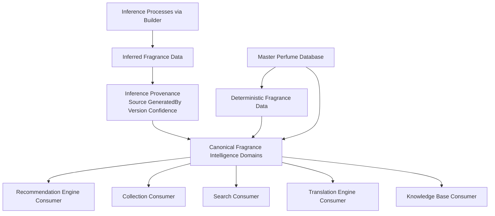

# Fragrance Intelligence Model v2

## Purpose
Define the canonical conceptual model of everything FragranceDNA knows about a fragrance.

## Owner
Fragrance Intelligence Team.

## Dependencies
CANONICAL_ARCHITECTURE_V2.md, ARCHITECTURE_FREEZE_V2_1.md, RECOMMENDATION_ENGINE.md, CONFIDENCE_ENGINE.md, ENGINE_VERSIONING.md.

## Canonical Responsibility
Provide a provider-agnostic fragrance intelligence contract consumable by Core Engine components and future Fragrance Intelligence Platform capabilities.

## Mission
Fragrance Intelligence Model v2 is the conceptual foundation for:
1. Master Perfume Database
2. Knowledge Base
3. Translation Engine
4. Builder
5. Recommendation Engine
6. Collection
7. Search

This document is not a database schema and not an implementation plan.
It defines conceptual intelligence domains and their contracts.

## Core Principles

### Deterministic vs Inferred Separation
Fragrance intelligence must clearly separate:
1. Deterministic data
2. Inferred data

Deterministic data is directly asserted or canonically normalized factual knowledge.
Inferred data is generated interpretation derived from deterministic and/or prior inferred evidence.

### Inference Provenance Requirement
Every inferred property must support provenance metadata including:
1. Source
2. Generated By
3. Version
4. Confidence

### Responsibility Boundary
Builder is responsible for generating inferred metadata.
Recommendation Engine consumes inferred metadata but never creates or modifies it.

### Extensibility Rule
The model must remain extensible without redesign.
Future domains and properties may be added while preserving canonical domain boundaries and provenance semantics.

## Canonical Domains
Fragrance intelligence is organized into conceptual domains.

### 1. Identity

#### Purpose
Establish a stable canonical identity for each fragrance across provider ecosystems and internal platform consumers.

#### Responsibilities
1. Define canonical fragrance identity.
2. Preserve identity continuity across provider naming variance.
3. Support unambiguous referencing by all consuming systems.

#### Information Scope
Identity domain contains canonical identity facts such as:
1. canonical fragrance entity identity
2. canonical naming context
3. brand association context
4. lineage references required for identity continuity

Identity should prioritize deterministic intelligence and stable canonical references.

### 2. Classification

#### Purpose
Represent how a fragrance is categorized in canonical platform taxonomy for discovery, filtering, and navigation.

#### Responsibilities
1. Define canonical category placement.
2. Support cross-surface segmentation for search, collection, and recommendation filtering.
3. Preserve distinction between declared classification and inferred classification.

#### Information Scope
Classification domain contains:
1. canonical category family placement
2. market-positioning class context
3. taxonomy-level grouping semantics
4. normalized classification labels used by platform consumers

Classification may include deterministic classification facts and inferred classification enrichments with full provenance.

### 3. Composition

#### Purpose
Represent what constitutes the fragrance from an ingredient, accord, and structural composition perspective in canonical form.

#### Responsibilities
1. Normalize composition facts from heterogeneous sources.
2. Preserve composition semantics needed by Builder and Translation layers.
3. Distinguish explicit composition knowledge from inferred composition interpretation.

#### Information Scope
Composition domain may contain:
1. notes and accord-level composition context
2. structural composition relationships
3. ingredient-family or accord-family grouping context
4. composition-derived canonical attribute grounding references

Composition domain is a primary bridge between raw fragrance descriptors and higher-order intelligence domains.

### 4. Olfactory Profile

#### Purpose
Describe the fragrance's canonical olfactory signature in platform-consumable intelligence terms.

#### Responsibilities
1. Express canonical olfactory characteristics.
2. Map fragrance perception profile into normalized profile surfaces used by recommendation and search.
3. Preserve explainable linkage from profile signals to supporting evidence.

#### Information Scope
Olfactory Profile domain may contain:
1. canonical olfactory attributes
2. profile axis tendencies
3. intensity and presence characteristics
4. profile-level confidence-aware descriptors

Olfactory Profile may include both deterministic descriptors and inferred profile enrichments with provenance.

### 5. Behavioral Profile

#### Purpose
Capture inferred usage-facing and user-response-facing fragrance behavior characteristics needed for intelligence consumers.

#### Responsibilities
1. Represent expected behavioral tendencies in canonical terms.
2. Provide confidence-aware behavioral intelligence that can improve over time.
3. Preserve traceability for all inferred behavioral signals.

#### Information Scope
Behavioral Profile domain may include:
1. inferred wear-context tendencies
2. inferred suitability tendencies
3. inferred behavioral descriptors relevant to user preference matching
4. behavior-level confidence and evidence context

Behavioral Profile is primarily inferred and must always include provenance metadata.

### 6. Recommendation Metadata

#### Purpose
Provide recommendation-consumable fragrance intelligence context that supports retrieval, filtering, ranking context, and explainability.

#### Responsibilities
1. Expose recommendation-facing fragrance intelligence in canonical format.
2. Support recommendation context compatibility without changing Recommendation Engine responsibilities.
3. Preserve clear boundary: metadata is generated by fragrance intelligence layers, consumed by recommendation layers.

#### Information Scope
Recommendation Metadata domain may include:
1. recommendation-usable category and context flags
2. compatibility-relevant fragrance intelligence descriptors
3. explainability-supporting fragrance evidence descriptors
4. recommendation-facing confidence context

Recommendation Metadata may contain deterministic and inferred elements, with provenance required for inferred elements.

### 7. Builder Metadata

#### Purpose
Represent the metadata required for Builder governance, generation lineage, validation, and controlled evolution of inferred fragrance intelligence.

#### Responsibilities
1. Track Builder generation lineage for inferred properties.
2. Preserve model-versioned inference context.
3. Support validation and quality controls without embedding implementation internals in consumer domains.

#### Information Scope
Builder Metadata domain includes governance-oriented metadata such as:
1. inference provenance package
2. generator identity
3. generator version lineage
4. confidence and evidence linkage metadata
5. validation-state references

Builder Metadata is mandatory for inferred properties and optional for deterministic properties where lineage is still beneficial.

## Deterministic Data Contract
Deterministic fragrance intelligence is canonically stable factual knowledge.

### Deterministic Responsibilities
1. Provide stable factual anchors for inference and consumption.
2. Preserve normalization consistency across providers.
3. Support replay-safe intelligence reconstruction.

### Deterministic Scope Guidance
Deterministic data may include identity facts, explicit classification facts, explicit composition facts, and other canonically normalized factual properties.

## Inferred Data Contract
Inferred fragrance intelligence is generated interpretation derived from evidence and Builder intelligence processes.

### Inferred Responsibilities
1. Enrich fragrance understanding beyond explicitly declared source facts.
2. Remain explainable and versioned.
3. Preserve confidence-aware trust signaling.

### Mandatory Provenance for Inferred Properties
Each inferred property must expose conceptual provenance fields:
1. Source
2. Generated By
3. Version
4. Confidence

This provenance contract is mandatory regardless of inference domain.

## Consumer Boundaries

### Recommendation Engine Boundary
Recommendation Engine consumes Fragrance Intelligence Model v2 outputs.
It does not create or mutate inferred fragrance metadata.

### Collection and Search Boundaries
Collection and Search consume canonical fragrance intelligence for retrieval, display, filtering, and user workflows.
They do not redefine canonical fragrance intelligence semantics.

### Builder Boundary
Builder generates and enriches inferred fragrance intelligence under provenance and versioning controls.
Builder does not redefine consumer engine responsibilities.

## Versioning and Evolution
Fragrance Intelligence Model v2 is versioned.

### Versioning Responsibilities
1. Preserve backward-compatible conceptual contracts where possible.
2. Require explicit version lineage for inferred property generation.
3. Support replay-compatible historical reconstruction of inference states.

### Evolution Rule
The model may evolve through domain enrichment and metadata expansion without redesigning engine contracts.
Future improvements should increase intelligence richness, evidence quality, and inference quality while preserving canonical boundaries.

## Out of Scope
This document does not define:
1. database schema
2. Builder implementation
3. Translation algorithms
4. Recommendation formulas
5. mapping implementation details
6. service wiring details

## Architecture Diagram

## Summary
Fragrance Intelligence Model v2 defines the canonical conceptual fragrance knowledge contract for FragranceDNA.
It organizes fragrance intelligence into stable domains, enforces deterministic-vs-inferred separation, mandates inference provenance, and enables future platform enrichment without redesigning Core Engine contracts.