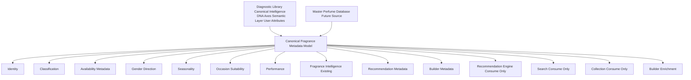

# Fragrance Metadata Model

## Purpose
Define the canonical metadata model that every fragrance object in FragranceDNA must eventually follow, regardless of origin.

## Owner
Fragrance Intelligence Team + Architecture.

## Dependencies
CANONICAL_ARCHITECTURE_V2.md, ARCHITECTURE_FREEZE_V2_1.md, FRAGRANCE_INTELLIGENCE_MODEL_V2.md, RECOMMENDATION_ENGINE.md.

## Canonical Responsibility
Provide a unified, extensible fragrance metadata contract consumable by Discovery, Recommendation, Search, Collection, Builder, and future Master Perfume Database workflows.

## Scope
This is architecture and documentation only.

This document does not define:
1. database schema
2. Builder implementation
3. Recommendation formulas
4. Discovery logic changes
5. runtime code changes
6. data migration scripts

## Canonical Architecture Rules
1. Existing Diagnostic Library fragrance intelligence remains canonical for intelligence domains already defined.
2. Existing intelligence structures (DNA Axes, Semantic Layer, User Attributes) are not redesigned here.
3. Builder enriches metadata and inferred intelligence; Builder does not manually redefine canonical intelligence semantics.
4. Recommendation Engine consumes metadata; it does not create metadata.
5. Search consumes metadata.
6. Collection consumes metadata.
7. All fragrance objects must eventually conform to one canonical metadata model.

## Current Canonical Fragrance Model (Diagnostic Library Audit)

### Audit Scope
The current Diagnostic Library and adjacent canonical fragrance assets were audited as-is.
No structures were changed.

### A. Canonical Intelligence Layer (Current)
Current canonical fragrance intelligence in `FragranceDNA_USER_ATTRIBUTE_LAYER_V3.json` is organized as:
1. root container with note + layers
2. fragrance layers with:
1. name
2. type
3. dna_axes
4. semantic_v1
5. user_attributes_v3

Current intelligence substructures present today:
1. DNA Axes (canonical axis profile values)
2. Semantic Layer (`semantic_v1` descriptors)
3. User Attributes (`abstract`, `concrete`)

These are considered correct and remain canonical.

### B. Evaluation Catalog Layer (Current)
Current evaluation catalog (`lib/db.json`) provides operational identity anchors used in current runtime services:
1. id
2. name
3. brand
4. notes

This layer currently provides practical identity and note context but not full canonical metadata coverage.

### C. Attribute Taxonomy Layer (Current)
Current canonical attribute library (`FragranceDNA_AttributeLibrary_v1.json`) provides grouped attribute taxonomy under:
1. RecognizableSmells
2. SensoryImpressions
3. IdentitySignals
4. BehavioralSignals

This is a core semantic vocabulary asset, not a full fragrance metadata model.

### D. Diagnostic Pool Segmentation Layer (Current)
Current pool asset (`MasterFragrancePool_v2_FINAL.json`) provides grouped fragrance name lists by segment:
1. core_niche
2. secondary_niche
3. designer
4. canonical_dupes

This supports curation/selection context but not per-fragrance unified metadata objects.

### E. Current Operational Canonical Fragrance Object (Runtime Consumption View)
Current adapter-level canonical object consumed by engine components includes:
1. fragranceId
2. displayName
3. coreAttributes
4. supportingAttributes

This is a valid serving contract for current behavior, but it is narrower than the future unified metadata architecture.

## Missing Metadata Analysis
The following categories are missing or incomplete for a unified cross-system fragrance object.

### 1. Identity Completeness Gaps
Current assets do not consistently expose complete identity metadata for all fragrance origins.
Examples of missing categories:
1. concentration
2. release year
3. stable cross-source identity linkage package

### 2. Classification Normalization Gaps
Segment labels exist in current assets, but full normalized classification metadata is incomplete at per-fragrance level.
Needed categories:
1. designer/niche/dupe classification at object level
2. brand type normalization
3. classification confidence/provenance where inferred

### 3. Availability Metadata Gaps
Current canonical layers do not provide unified availability metadata needed for recommendation context, search filtering, and collection workflows.
Needed categories:
1. availability tier
2. mainstream/limited/discontinued states
3. easy-to-find signal

### 4. Gender Direction Gaps
Current intelligence does not provide a unified gender-direction metadata domain for all fragrance objects.
Needed categories:
1. leaning feminine
2. unisex
3. leaning masculine

### 5. Seasonality Gaps
Current canonical fragrance intelligence is rich in profile signals but does not expose unified seasonality metadata for all objects.
Needed categories:
1. spring
2. summer
3. autumn
4. winter

### 6. Occasion Suitability Gaps
Current assets do not provide a unified occasion-suitability layer for all fragrance objects.
Needed categories:
1. daily
2. office
3. casual
4. formal
5. evening
6. date
7. vacation
8. signature

### 7. Performance Metadata Gaps
Current canonical assets do not provide standardized performance metadata across all objects.
Needed categories:
1. projection
2. longevity
3. sillage

### 8. Recommendation/Search/Collection Utility Gaps
Current model does not yet define one shared metadata package for explainability hooks, search metadata, and similarity relationships.
Needed categories:
1. explainability hooks
2. search metadata
3. future similarity relationships

### 9. Builder Governance Metadata Gaps
Current inferred metadata governance package is not yet unified per fragrance object.
Needed categories:
1. version
2. source
3. generated by
4. confidence
5. last updated

## Canonical Fragrance Metadata Model (Target Contract)
Every fragrance object must eventually expose a unified metadata model organized by conceptual domains.

Each domain below defines:
1. Purpose
2. Responsibilities
3. Future consumers
4. Examples of contained information

### 1. Identity Domain

#### Purpose
Provide stable identity anchors shared across Diagnostic Library, Master Perfume Database, Search, Collection, and Recommendation.

#### Responsibilities
1. maintain canonical identity continuity
2. support unambiguous cross-system referencing
3. normalize basic identity descriptors

#### Future Consumers
1. Recommendation Engine
2. Search
3. Collection
4. Builder
5. Knowledge Base

#### Examples of Contained Information
1. brand
2. fragrance name
3. concentration
4. release year
5. canonical identity linkage references

### 2. Classification Domain

#### Purpose
Define normalized classification metadata for filtering, segmentation, and cross-surface consistency.

#### Responsibilities
1. represent category class at fragrance-object level
2. preserve stable classification semantics across systems
3. support context filtering without recommendation-logic leakage

#### Future Consumers
1. Recommendation Engine
2. Search
3. Collection
4. Builder

#### Examples of Contained Information
1. designer
2. niche
3. dupe
4. brand type

### 3. Availability Metadata Domain

#### Purpose
Represent acquisition and market-presence status metadata needed by future recommendation context and search operations.

#### Responsibilities
1. expose consistent availability state
2. support filtering and preference constraints
3. preserve distinction between deterministic and inferred availability signals

#### Future Consumers
1. Recommendation Engine
2. Search
3. Collection
4. Builder

#### Examples of Contained Information
1. availability tier
2. mainstream
3. limited
4. discontinued
5. easy to find

### 4. Gender Direction Domain

#### Purpose
Provide canonical gender-direction metadata for context matching and filtering.

#### Responsibilities
1. expose normalized gender-direction representation
2. support recommendation context compatibility
3. support search and collection categorization

#### Future Consumers
1. Recommendation Engine
2. Search
3. Collection

#### Examples of Contained Information
1. leaning feminine
2. unisex
3. leaning masculine

### 5. Seasonality Domain

#### Purpose
Represent seasonal suitability metadata in canonical form.

#### Responsibilities
1. expose seasonality semantics consistently
2. support context-aware recommendation and search
3. remain compatible with future enrichment

#### Future Consumers
1. Recommendation Engine
2. Search
3. Collection
4. Builder

#### Examples of Contained Information
1. spring
2. summer
3. autumn
4. winter

### 6. Occasion Suitability Domain

#### Purpose
Represent usage-context suitability metadata for fragrance consumption surfaces.

#### Responsibilities
1. expose normalized occasion suitability descriptors
2. support recommendation context matching
3. support search and collection utility views

#### Future Consumers
1. Recommendation Engine
2. Search
3. Collection
4. Knowledge Base

#### Examples of Contained Information
1. daily
2. office
3. casual
4. formal
5. evening
6. date
7. vacation
8. signature

### 7. Performance Domain

#### Purpose
Represent performance-oriented fragrance behavior descriptors in canonical metadata form.

#### Responsibilities
1. expose consistent performance descriptors
2. support explainability and consumer-facing interpretation
3. support future confidence-aware enrichment

#### Future Consumers
1. Recommendation Engine
2. Search
3. Collection
4. Knowledge Base
5. Builder

#### Examples of Contained Information
1. projection
2. longevity
3. sillage

### 8. Fragrance Intelligence Domain (Existing Canonical Intelligence)

#### Purpose
Embed the already-canonical intelligence structures without redesigning them.

#### Responsibilities
1. preserve existing canonical intelligence semantics
2. serve as primary intelligence core for downstream consumers
3. remain compatible with Builder enrichment

#### Future Consumers
1. Discovery Engine
2. Recommendation Engine
3. Search
4. Collection
5. Builder

#### Examples of Contained Information
1. DNA Axes
2. Semantic Layer
3. User Attributes

Note:
this domain is referenced as existing canonical intelligence and is not redesigned in this document.

### 9. Recommendation Metadata Domain

#### Purpose
Provide recommendation-consumable metadata without embedding recommendation formulas.

#### Responsibilities
1. expose explainability-supporting fragrance metadata
2. expose context/filter utility metadata
3. expose future relationship scaffolding for recommendation quality improvements

#### Future Consumers
1. Recommendation Engine
2. Search
3. Collection
4. Builder

#### Examples of Contained Information
1. explainability hooks
2. search metadata
3. future similarity relationships

### 10. Builder Metadata Domain

#### Purpose
Provide inference governance metadata for enriched properties.

#### Responsibilities
1. preserve provenance for inferred metadata
2. support validation and reproducibility
3. support controlled metadata evolution

#### Future Consumers
1. Builder
2. Validation Pipeline
3. Knowledge Base
4. Recommendation Engine (read-only consumption)

#### Examples of Contained Information
1. version
2. source
3. generated by
4. confidence
5. last updated

## Deterministic vs Inferred Metadata Policy

### Deterministic Metadata
Deterministic metadata is directly asserted or canonically normalized factual information.

### Inferred Metadata
Inferred metadata is generated by Builder or intelligence enrichment processes and must carry provenance.

### Mandatory Provenance for Inferred Metadata
Every inferred property must support:
1. source
2. generated by
3. version
4. confidence

## Conceptual Architecture Diagram

## Migration Strategy (Conceptual)
Migration is architecture-led and staged.
No data migration is executed in this step.

### Stage 1: Contract Freeze
1. freeze canonical metadata domains
2. preserve existing Diagnostic Library intelligence unchanged

### Stage 2: Diagnostic-to-Canonical Mapping Plan
1. map existing Diagnostic Library structures into target metadata domains
2. identify deterministic vs inferred properties per domain
3. identify unresolved metadata gaps

### Stage 3: Master Perfume Database Conformance
1. ensure future Master Perfume Database emits fragrance objects conforming to canonical metadata domains
2. enforce provenance requirements for inferred metadata

### Stage 4: Consumer Alignment
1. Recommendation Engine consumes unified metadata contract
2. Search consumes unified metadata contract
3. Collection consumes unified metadata contract
4. Builder enriches metadata without redefining canonical intelligence

### Stage 5: Validation Pipeline Governance
1. validate domain completeness
2. validate deterministic/inferred classification
3. validate provenance coverage for inferred fields
4. validate backward compatibility with existing canonical intelligence

## Future Builder Responsibilities (Conceptual)
Builder responsibilities under this model:
1. enrich inferred metadata domains
2. maintain provenance package for inferred properties
3. preserve compatibility with frozen engine contracts
4. avoid manual redefinition of canonical fragrance intelligence semantics

Builder must not:
1. redesign DNA Axes, Semantic Layer, or User Attributes semantics
2. embed recommendation formulas into metadata architecture
3. bypass provenance requirements

## Acceptance Criteria
This canonical model is accepted when:
1. current Diagnostic Library audit is documented clearly and accurately
2. missing metadata categories are identified without implementation detail
3. canonical domains are defined with purpose, responsibilities, future consumers, and examples
4. existing fragrance intelligence (DNA Axes, Semantic Layer, User Attributes) is referenced without redesign
5. deterministic vs inferred policy is explicit
6. inferred provenance requirements are explicit
7. conceptual architecture diagram is included
8. migration strategy is defined conceptually
9. Builder responsibilities are defined conceptually
10. no runtime code, database schema, or implementation logic is introduced

## Summary
Fragrance Metadata Model defines the canonical unified fragrance object architecture for FragranceDNA.
It extends the ecosystem around the existing Diagnostic Library intelligence, identifies metadata gaps needed for platform-wide unification, and establishes the migration contract toward a future Master Perfume Database without changing current engine behavior.