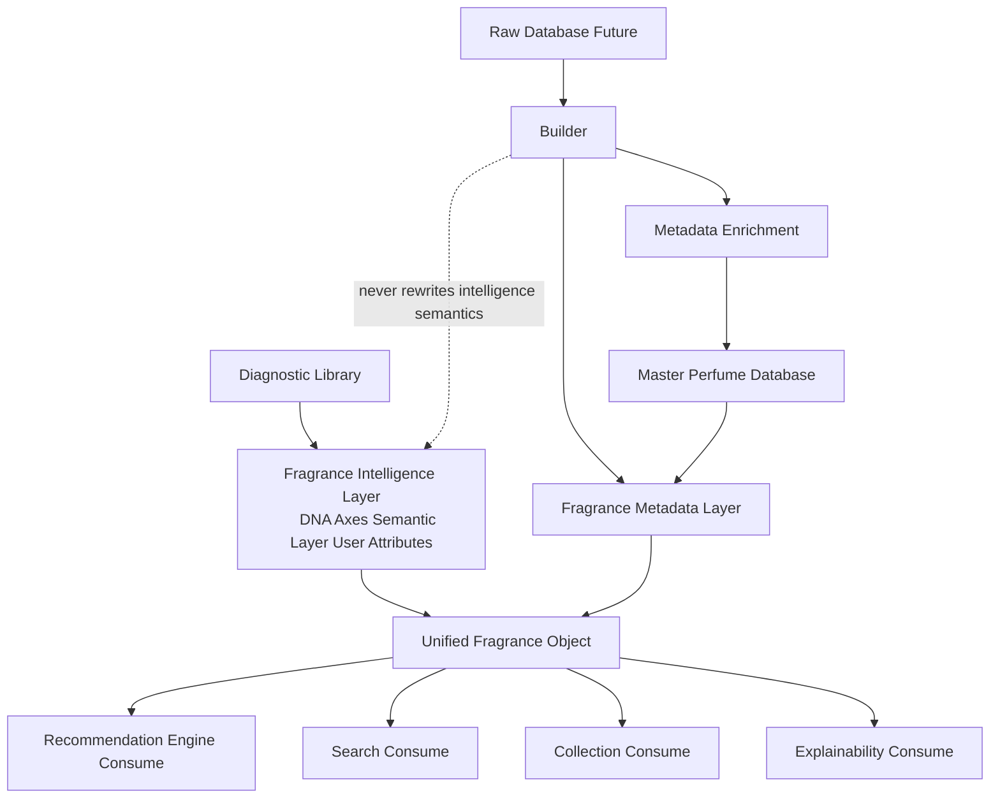

# Fragrance Metadata Schema

## Purpose
Define the canonical metadata contract for every fragrance object in FragranceDNA.

## Owner
Fragrance Intelligence Team + Architecture.

## Dependencies
PRODUCT_DOCTRINE.md, ARCHITECTURE_PRINCIPLES.md, CANONICAL_ARCHITECTURE_V2.md, ARCHITECTURE_FREEZE_V2_1.md, FRAGRANCE_METADATA_MODEL.md, RECOMMENDATION_ENGINE.md, CONFIDENCE_ENGINE.md, LEARNING_MODEL.md.

## Canonical Responsibility
Provide one unified metadata schema that can be consumed consistently by Diagnostic Library, Master Perfume Database, Builder, Search, Collection, Recommendation Engine, and Explainability.

## Scope And Constraints
This is architecture and documentation only.

This document does not:
1. change runtime code
2. modify Discovery Engine
3. modify Recommendation Engine
4. modify Learning Engine
5. modify Confidence Engine
6. modify Builder implementation
7. modify fragrance JSON files
8. define recommendation logic
9. define database schema
10. define data migration scripts

## Two-Layer Canonical Model
Every fragrance object is modeled with two independent layers.

### Layer 1: Fragrance Intelligence
Contains existing canonical intelligence:
1. DNA Axes
2. Semantic Layer
3. User Attributes

This layer already exists and is not redesigned here.

### Layer 2: Fragrance Metadata
Contains descriptive and governance metadata used for:
1. Search
2. Collection
3. Recommendation filtering context
4. Explainability
5. Builder governance

### Permanent Independence Rule
1. Fragrance Intelligence and Fragrance Metadata remain independent.
2. Recommendation Engine consumes both layers.
3. Builder enriches Metadata.
4. Builder never rewrites Fragrance Intelligence semantics.

## Current Canonical Fragrance Model (Diagnostic Library Audit)

### Audit Scope
Audit performed on current canonical assets without modifications:
1. data/FragranceDNA_USER_ATTRIBUTE_LAYER_V3.json
2. lib/db.json
3. _Fragrance DNA/_GPT/FragranceDNA_AttributeLibrary_v1.json
4. _Fragrance DNA/_GPT/MasterFragrancePool_v2_FINAL.json
5. runtime canonical fragrance adapter contract

### Audit Table
| Current Structure | Purpose | Keep | Rename | Move | Deprecated | Target Metadata Domain |
|---|---|---|---|---|---|---|
| FragranceDNA_USER_ATTRIBUTE_LAYER_v3.layers[].name | Canonical fragrance display identity in Diagnostic Library | Yes | No | No | No | Identity |
| FragranceDNA_USER_ATTRIBUTE_LAYER_v3.layers[].type | Current classification hint in diagnostic layer | Yes | Yes, into origin | No | No | Classification |
| FragranceDNA_USER_ATTRIBUTE_LAYER_v3.layers[].dna_axes | Canonical intelligence axis profile | Yes | No | No | No | Fragrance Intelligence (existing) |
| FragranceDNA_USER_ATTRIBUTE_LAYER_v3.layers[].semantic_v1 | Canonical semantic intelligence layer | Yes | No | No | No | Fragrance Intelligence (existing) |
| FragranceDNA_USER_ATTRIBUTE_LAYER_v3.layers[].user_attributes_v3.abstract | Canonical abstract user-facing intelligence descriptors | Yes | No | No | No | Fragrance Intelligence (existing) |
| FragranceDNA_USER_ATTRIBUTE_LAYER_v3.layers[].user_attributes_v3.concrete | Canonical concrete user-facing intelligence descriptors | Yes | No | No | No | Fragrance Intelligence (existing) |
| lib/db.json[].id | Runtime evaluation identity key | Yes | No | No | No | Identity |
| lib/db.json[].name | Runtime display name for evaluation catalog | Yes | No | No | No | Identity |
| lib/db.json[].brand | Runtime brand label used by current surfaces | Yes | No | No | No | Identity |
| lib/db.json[].notes | Runtime note hints used by current adapter | Yes | No | Potentially represented as signature notes metadata in future | No | Explainability Metadata |
| FragranceDNA_AttributeLibrary_v1.categories.RecognizableSmells | Canonical attribute taxonomy group | Yes | No | No | No | Fragrance Intelligence (existing taxonomy support) |
| FragranceDNA_AttributeLibrary_v1.categories.SensoryImpressions | Canonical attribute taxonomy group | Yes | No | No | No | Fragrance Intelligence (existing taxonomy support) |
| FragranceDNA_AttributeLibrary_v1.categories.IdentitySignals | Canonical attribute taxonomy group | Yes | No | No | No | Fragrance Intelligence (existing taxonomy support) |
| FragranceDNA_AttributeLibrary_v1.categories.BehavioralSignals | Canonical attribute taxonomy group | Yes | No | No | No | Fragrance Intelligence (existing taxonomy support) |
| MasterFragrancePool_v2_FINAL.core_niche | Curated fragrance list segment | Yes | No | No | No | Classification support (origin = Niche) |
| MasterFragrancePool_v2_FINAL.secondary_niche | Curated fragrance list segment | Yes | No | No | No | Classification support (origin = Niche) |
| MasterFragrancePool_v2_FINAL.designer | Curated fragrance list segment | Yes | No | No | No | Classification support (origin = Designer) |
| MasterFragrancePool_v2_FINAL.canonical_dupes | Curated fragrance list segment | Yes | No | No | No | Classification support (origin = Dupe) |
| Runtime canonical fragrance object: fragranceId | Current canonical service identity reference | Yes | No | No | No | Identity |
| Runtime canonical fragrance object: displayName | Current canonical service display name | Yes | No | No | No | Identity |
| Runtime canonical fragrance object: coreAttributes | Current canonical recommendation and evaluation intelligence view | Yes | No | No | No | Fragrance Intelligence (existing) |
| Runtime canonical fragrance object: supportingAttributes | Current canonical intelligence support layer | Yes | No | No | No | Fragrance Intelligence (existing) |

### Audit Conclusion
1. Existing fragrance intelligence structures are complete for current Diagnostic Library intelligence purposes and are preserved.
2. Metadata surrounding that intelligence is partial and non-uniform across assets.
3. Unified metadata schema is required to ensure origin-independent fragrance objects.

## Missing Metadata Analysis
Missing categories needed for unified model (categories only, no values invented):
1. normalized identity completeness metadata
2. normalized origin classification at per-fragrance object level
3. availability metadata
4. gender direction metadata
5. seasonality metadata
6. occasion suitability metadata
7. performance metadata
8. structural relationship metadata
9. explainability metadata hooks
10. builder governance metadata
11. consistent deterministic versus inferred declaration per property

## Canonical Property Domains
Each metadata domain below includes purpose, responsibilities, future consumers, and examples of contained information.

### Domain 1: Identity

#### Purpose
Provide stable identity anchors across all fragrance sources.

#### Responsibilities
1. ensure canonical fragrance reference stability
2. support cross-source identity continuity
3. support collection/search/recommendation references

#### Future Consumers
1. Builder
2. Search
3. Collection
4. Recommendation
5. Explainability

#### Examples Of Contained Information
1. id
2. brand
3. fragrance_name
4. collection
5. concentration
6. release_year
7. perfumer

### Domain 2: Classification

#### Purpose
Provide normalized source-classification and stylistic metadata.

#### Responsibilities
1. separate fragrance origin from style
2. preserve canonical filtering semantics
3. support context and search facets

#### Future Consumers
1. Builder
2. Search
3. Collection
4. Recommendation

#### Examples Of Contained Information
1. origin
2. brand_type
3. style_family (future-extensible)

#### Canonical Origin Decision
Property origin is canonical with allowed values:
1. Designer
2. Niche
3. Dupe

Why origin replaces current type:
1. type is overloaded in existing assets
2. origin is explicit and stable for filtering and context
3. stylistic classifications must remain independent from source origin

### Domain 3: Availability

#### Purpose
Represent acquisition reality metadata for search and recommendation context.

#### Responsibilities
1. expose availability state without recommendation logic
2. support context constraints and filtering
3. remain Builder-managed and provenance-aware

#### Future Consumers
1. Builder
2. Search
3. Collection
4. Recommendation
5. Explainability

#### Examples Of Contained Information
1. availability_class
2. easy_to_find
3. discontinued
4. limited_edition
5. reformulated

#### Canonical Availability Decision
Availability should eventually be estimated primarily from Brand-level metadata managed by Builder.
Individual fragrances may override Brand defaults only when necessary.
This reduces manual maintenance while preserving realistic metadata quality.

### Domain 4: Gender Direction

#### Purpose
Provide fragrance-level gender-direction metadata for context filtering and ranking preference.

#### Responsibilities
1. expose canonical gender-direction options
2. support recommendation context without modifying user DNA
3. support search and collection facets

#### Future Consumers
1. Builder
2. Search
3. Collection
4. Recommendation

#### Examples Of Contained Information
1. Leaning Feminine
2. Unisex
3. Leaning Masculine

#### Canonical Context Principle
Gender Direction here is fragrance metadata only.
Recommendation Context may temporarily request a Gender Direction.
The last selected Gender Direction may be used as default Recommendation Context in future sessions until manually changed.
This must never modify Persistent User DNA.

### Domain 5: Seasonality

#### Purpose
Represent seasonal suitability metadata.

#### Responsibilities
1. expose seasonality descriptors consistently
2. support context preference and filtering
3. remain independent from recommendation formulas

#### Future Consumers
1. Builder
2. Search
3. Collection
4. Recommendation

#### Examples Of Contained Information
1. spring
2. summer
3. autumn
4. winter

### Domain 6: Occasion Suitability

#### Purpose
Represent occasion-fit metadata for user workflows.

#### Responsibilities
1. expose occasion suitability descriptors
2. support search/collection labeling
3. support recommendation context constraints

#### Future Consumers
1. Builder
2. Search
3. Collection
4. Recommendation
5. Explainability

#### Examples Of Contained Information
1. daily
2. office
3. casual
4. formal
5. evening
6. date
7. vacation
8. signature

### Domain 7: Performance

#### Purpose
Represent performance estimates without algorithm definition.

#### Responsibilities
1. expose projection/longevity/sillage descriptors
2. support explainability and user-facing interpretation
3. preserve deterministic vs inferred declaration

#### Future Consumers
1. Builder
2. Search
3. Collection
4. Recommendation
5. Explainability

#### Examples Of Contained Information
1. projection_estimate
2. longevity_estimate
3. sillage_estimate

### Domain 8: Relationships

#### Purpose
Represent structural fragrance relationships without similarity scoring.

#### Responsibilities
1. encode explicit relationships
2. support optional warnings and explainability hooks
3. preserve structural relationship semantics

#### Future Consumers
1. Builder
2. Recommendation
3. Search
4. Collection
5. Explainability

#### Examples Of Contained Information
1. clone_of
2. inspired_by
3. flanker_of
4. same_collection

#### Canonical Relationship Rule
Recommendation Engine must not penalize fragrances merely because they are similar to owned fragrances.
Collection awareness provides context.
Only explicit clone or near-identical duplicate relationships may later trigger optional warnings.

### Domain 9: Explainability Metadata

#### Purpose
Provide fragrance-side explainability support fields.

#### Responsibilities
1. enrich explanation quality
2. remain independent from compatibility scoring formulas
3. expose interpretable descriptors for user-facing rationale

#### Future Consumers
1. Explainability
2. Recommendation
3. Search
4. Collection

#### Examples Of Contained Information
1. signature_notes
2. signature_accords
3. signature_character
4. luxury_hooks
5. opening_character
6. drydown_character

### Domain 10: Builder Metadata

#### Purpose
Provide provenance and governance metadata for inferred and enriched fields.

#### Responsibilities
1. track enrichment provenance
2. support validation and reproducibility
3. support lifecycle governance

#### Future Consumers
1. Builder
2. Recommendation
3. Search
4. Collection
5. Explainability
6. Validation Pipeline

#### Examples Of Contained Information
1. source
2. generated_by
3. version
4. confidence
5. last_updated
6. validation_status
7. processing_version

### Domain 11: Fragrance Intelligence (Existing, Referenced)

#### Purpose
Reference existing canonical intelligence domain without redesign.

#### Responsibilities
1. preserve canonical intelligence continuity
2. keep intelligence and metadata separation intact

#### Future Consumers
1. Discovery
2. Recommendation
3. Search
4. Collection
5. Builder

#### Examples Of Contained Information
1. DNA Axes
2. Semantic Layer
3. User Attributes

## Canonical Property Catalog
Every metadata property is documented individually.

| Property Name | Description | Data Type | Required/Optional | Source | Deterministic/Inferred | Generated By | Consumers | Future Extensible | Notes |
|---|---|---|---|---|---|---|---|---|---|
| id | Canonical fragrance identifier | string | Required | Diagnostic Library and future Master Perfume Database identity anchor | Deterministic | N/A | Builder, Search, Collection, Recommendation, Explainability | No | Primary cross-system reference |
| brand | Canonical brand name | string | Required | Diagnostic Library identity plus future canonical source normalization | Deterministic | N/A | Builder, Search, Collection, Recommendation, Explainability | Yes | Brand-level intelligence may enrich linked metadata |
| fragrance_name | Canonical fragrance display name | string | Required | Diagnostic Library name and future canonical source normalization | Deterministic | N/A | Builder, Search, Collection, Recommendation, Explainability | Yes | Name normalization rules are implementation concern |
| collection | Brand collection or line reference | string | Optional | Provider/master source and Builder enrichment | Deterministic | N/A | Builder, Search, Collection, Recommendation, Explainability | Yes | Not the user collection state |
| concentration | Concentration designation | enum | Optional | Provider/master source and normalization | Deterministic | N/A | Builder, Search, Collection, Recommendation, Explainability | Yes | Example categories are managed in implementation layer |
| release_year | Original release year | integer | Optional | Provider/master source | Deterministic | N/A | Builder, Search, Collection, Recommendation, Explainability | Yes | Supports context and explainability |
| perfumer | Perfumer attribution | string or array of string | Optional | Provider/master source | Deterministic | N/A | Builder, Search, Collection, Recommendation, Explainability | Yes | Multiple perfumers allowed conceptually |
| origin | Source-class classification | enum | Required | Diagnostic segments and future canonical classification mapping | Deterministic | N/A | Builder, Search, Collection, Recommendation, Explainability | No | Allowed values: Designer, Niche, Dupe |
| brand_type | Brand-level market positioning class | enum | Optional | Brand intelligence and canonical classification enrichment | Inferred | Builder | Builder, Search, Collection, Recommendation, Explainability | Yes | Kept independent from origin |
| style_family | Stylistic family classification | enum or array of enum | Optional | Inference and/or curated taxonomy mapping | Inferred | Builder | Builder, Search, Collection, Recommendation, Explainability | Yes | Must remain independent from origin |
| availability_class | High-level availability state | enum | Optional | Brand intelligence defaults plus fragrance overrides | Inferred | Builder | Builder, Search, Collection, Recommendation, Explainability | Yes | Supports context filtering |
| easy_to_find | Acquisition ease indicator | boolean | Optional | Brand intelligence and market evidence | Inferred | Builder | Builder, Search, Collection, Recommendation, Explainability | Yes | May derive from brand defaults |
| discontinued | Discontinued status indicator | boolean | Optional | Brand intelligence and source validation | Inferred | Builder | Builder, Search, Collection, Recommendation, Explainability | Yes | Hard filter candidate in future contexts |
| limited_edition | Limited availability indicator | boolean | Optional | Brand intelligence and source validation | Inferred | Builder | Builder, Search, Collection, Recommendation, Explainability | Yes | Availability-related metadata only |
| reformulated | Reformulation indicator | boolean | Optional | Source evidence and Builder enrichment | Inferred | Builder | Builder, Search, Collection, Recommendation, Explainability | Yes | May affect explainability context |
| gender_direction | Canonical gender-direction metadata | enum | Optional | Builder enrichment from canonical fragrance evidence | Inferred | Builder | Builder, Search, Collection, Recommendation, Explainability | Yes | Allowed values: Leaning Feminine, Unisex, Leaning Masculine |
| season_spring | Spring suitability signal | boolean or ordinal enum | Optional | Builder enrichment | Inferred | Builder | Builder, Search, Collection, Recommendation, Explainability | Yes | Properties only, no scoring formula |
| season_summer | Summer suitability signal | boolean or ordinal enum | Optional | Builder enrichment | Inferred | Builder | Builder, Search, Collection, Recommendation, Explainability | Yes | Properties only, no scoring formula |
| season_autumn | Autumn suitability signal | boolean or ordinal enum | Optional | Builder enrichment | Inferred | Builder | Builder, Search, Collection, Recommendation, Explainability | Yes | Properties only, no scoring formula |
| season_winter | Winter suitability signal | boolean or ordinal enum | Optional | Builder enrichment | Inferred | Builder | Builder, Search, Collection, Recommendation, Explainability | Yes | Properties only, no scoring formula |
| occasion_daily | Daily suitability signal | boolean or ordinal enum | Optional | Builder enrichment | Inferred | Builder | Builder, Search, Collection, Recommendation, Explainability | Yes | Occasions are metadata descriptors |
| occasion_office | Office suitability signal | boolean or ordinal enum | Optional | Builder enrichment | Inferred | Builder | Builder, Search, Collection, Recommendation, Explainability | Yes | Occasions are metadata descriptors |
| occasion_casual | Casual suitability signal | boolean or ordinal enum | Optional | Builder enrichment | Inferred | Builder | Builder, Search, Collection, Recommendation, Explainability | Yes | Occasions are metadata descriptors |
| occasion_formal | Formal suitability signal | boolean or ordinal enum | Optional | Builder enrichment | Inferred | Builder | Builder, Search, Collection, Recommendation, Explainability | Yes | Occasions are metadata descriptors |
| occasion_evening | Evening suitability signal | boolean or ordinal enum | Optional | Builder enrichment | Inferred | Builder | Builder, Search, Collection, Recommendation, Explainability | Yes | Occasions are metadata descriptors |
| occasion_date | Date suitability signal | boolean or ordinal enum | Optional | Builder enrichment | Inferred | Builder | Builder, Search, Collection, Recommendation, Explainability | Yes | Occasions are metadata descriptors |
| occasion_vacation | Vacation suitability signal | boolean or ordinal enum | Optional | Builder enrichment | Inferred | Builder | Builder, Search, Collection, Recommendation, Explainability | Yes | Occasions are metadata descriptors |
| occasion_signature | Signature suitability signal | boolean or ordinal enum | Optional | Builder enrichment | Inferred | Builder | Builder, Search, Collection, Recommendation, Explainability | Yes | Occasions are metadata descriptors |
| projection_estimate | Projection descriptor | enum or ordinal | Optional | Builder enrichment from fragrance evidence | Inferred | Builder | Builder, Search, Collection, Recommendation, Explainability | Yes | No algorithm specified here |
| longevity_estimate | Longevity descriptor | enum or ordinal | Optional | Builder enrichment from fragrance evidence | Inferred | Builder | Builder, Search, Collection, Recommendation, Explainability | Yes | No algorithm specified here |
| sillage_estimate | Sillage descriptor | enum or ordinal | Optional | Builder enrichment from fragrance evidence | Inferred | Builder | Builder, Search, Collection, Recommendation, Explainability | Yes | No algorithm specified here |
| clone_of | Explicit clone relationship reference | string or array of string | Optional | Curated relationship metadata and validation | Deterministic | N/A | Builder, Search, Collection, Recommendation, Explainability | Yes | Structural relationship only |
| inspired_by | Inspiration relationship reference | string or array of string | Optional | Curated relationship metadata and validation | Deterministic | N/A | Builder, Search, Collection, Recommendation, Explainability | Yes | Structural relationship only |
| flanker_of | Flanker relationship reference | string | Optional | Curated relationship metadata and validation | Deterministic | N/A | Builder, Search, Collection, Recommendation, Explainability | Yes | Structural relationship only |
| same_collection_relationship | Same line relationship reference | string or array of string | Optional | Curated relationship metadata and validation | Deterministic | N/A | Builder, Search, Collection, Recommendation, Explainability | Yes | Structural relationship only |
| signature_notes | Explainability-facing note set | array of string | Optional | Existing intelligence and Builder enrichment | Inferred | Builder | Builder, Search, Collection, Recommendation, Explainability | Yes | Explainability hook only |
| signature_accords | Explainability-facing accord set | array of string | Optional | Existing intelligence and Builder enrichment | Inferred | Builder | Builder, Search, Collection, Recommendation, Explainability | Yes | Explainability hook only |
| signature_character | Explainability-facing character summary | string or array of string | Optional | Existing intelligence and Builder enrichment | Inferred | Builder | Builder, Search, Collection, Recommendation, Explainability | Yes | Explainability hook only |
| luxury_hooks | Luxury context descriptors | array of string | Optional | Existing intelligence and Builder enrichment | Inferred | Builder | Builder, Search, Collection, Recommendation, Explainability | Yes | Explainability hook only |
| opening_character | Opening phase descriptor | string | Optional | Existing intelligence and Builder enrichment | Inferred | Builder | Builder, Search, Collection, Recommendation, Explainability | Yes | Explainability hook only |
| drydown_character | Drydown phase descriptor | string | Optional | Existing intelligence and Builder enrichment | Inferred | Builder | Builder, Search, Collection, Recommendation, Explainability | Yes | Explainability hook only |
| source | Provenance source for metadata enrichment | string | Required for inferred properties | Builder provenance package | Deterministic | Builder | Builder, Search, Collection, Recommendation, Explainability, Validation Pipeline | Yes | Mandatory for inferred properties |
| generated_by | Generator identity | string | Required for inferred properties | Builder provenance package | Deterministic | Builder | Builder, Search, Collection, Recommendation, Explainability, Validation Pipeline | Yes | Mandatory for inferred properties |
| version | Metadata generation version | string | Required for inferred properties | Builder provenance package | Deterministic | Builder | Builder, Search, Collection, Recommendation, Explainability, Validation Pipeline | Yes | Mandatory for inferred properties |
| confidence | Confidence of inferred metadata | number or ordinal enum | Required for inferred properties | Builder inference output | Inferred | Builder | Builder, Search, Collection, Recommendation, Explainability, Validation Pipeline | Yes | Mandatory for inferred properties |
| last_updated | Last metadata update timestamp | datetime | Required | Builder processing lifecycle | Deterministic | Builder | Builder, Search, Collection, Recommendation, Explainability, Validation Pipeline | Yes | Governance metadata |
| validation_status | Validation state marker | enum | Optional | Validation pipeline output | Deterministic | Builder and Validation Pipeline | Builder, Search, Collection, Recommendation, Explainability, Validation Pipeline | Yes | Governance metadata |
| processing_version | Builder processing pipeline version | string | Optional | Builder processing lifecycle | Deterministic | Builder | Builder, Search, Collection, Recommendation, Explainability, Validation Pipeline | Yes | Governance metadata |
| intelligence_dna_axes_ref | Reference to existing canonical DNA Axes intelligence | object reference | Required | Diagnostic Library canonical intelligence | Deterministic | N/A | Builder, Discovery, Recommendation, Search, Collection, Explainability | Yes | Existing intelligence, not redesigned |
| intelligence_semantic_layer_ref | Reference to existing semantic layer intelligence | object reference | Required | Diagnostic Library canonical intelligence | Deterministic | N/A | Builder, Discovery, Recommendation, Search, Collection, Explainability | Yes | Existing intelligence, not redesigned |
| intelligence_user_attributes_ref | Reference to existing user attributes intelligence | object reference | Required | Diagnostic Library canonical intelligence | Deterministic | N/A | Builder, Discovery, Recommendation, Search, Collection, Explainability | Yes | Existing intelligence, not redesigned |

## Consumer Matrix
Consumer usage matrix for canonical properties.

| Property | Builder | Search | Collection | Recommendation | Explainability |
|---|---|---|---|---|---|
| id | Yes | Yes | Yes | Yes | Yes |
| brand | Yes | Yes | Yes | Yes | Yes |
| fragrance_name | Yes | Yes | Yes | Yes | Yes |
| collection | Yes | Yes | Yes | Yes | Yes |
| concentration | Yes | Yes | Yes | Yes | Yes |
| release_year | Yes | Yes | Yes | Yes | Yes |
| perfumer | Yes | Yes | Yes | Optional | Yes |
| origin | Yes | Yes | Yes | Yes | Yes |
| brand_type | Yes | Yes | Optional | Yes | Optional |
| style_family | Yes | Yes | Optional | Yes | Optional |
| availability_class | Yes | Yes | Optional | Yes | Yes |
| easy_to_find | Yes | Yes | Optional | Yes | Yes |
| discontinued | Yes | Yes | Optional | Yes | Yes |
| limited_edition | Yes | Yes | Optional | Yes | Yes |
| reformulated | Yes | Optional | Optional | Optional | Yes |
| gender_direction | Yes | Yes | Yes | Yes | Yes |
| season_spring | Yes | Yes | Optional | Yes | Optional |
| season_summer | Yes | Yes | Optional | Yes | Optional |
| season_autumn | Yes | Yes | Optional | Yes | Optional |
| season_winter | Yes | Yes | Optional | Yes | Optional |
| occasion_daily | Yes | Yes | Optional | Yes | Optional |
| occasion_office | Yes | Yes | Optional | Yes | Optional |
| occasion_casual | Yes | Yes | Optional | Yes | Optional |
| occasion_formal | Yes | Yes | Optional | Yes | Optional |
| occasion_evening | Yes | Yes | Optional | Yes | Optional |
| occasion_date | Yes | Yes | Optional | Yes | Optional |
| occasion_vacation | Yes | Optional | Optional | Yes | Optional |
| occasion_signature | Yes | Optional | Optional | Yes | Yes |
| projection_estimate | Yes | Yes | Yes | Optional | Yes |
| longevity_estimate | Yes | Yes | Yes | Optional | Yes |
| sillage_estimate | Yes | Yes | Yes | Optional | Yes |
| clone_of | Yes | Optional | Optional | Yes | Yes |
| inspired_by | Yes | Optional | Optional | Optional | Yes |
| flanker_of | Yes | Yes | Yes | Optional | Yes |
| same_collection_relationship | Yes | Yes | Yes | Optional | Yes |
| signature_notes | Yes | Yes | Yes | Optional | Yes |
| signature_accords | Yes | Yes | Yes | Optional | Yes |
| signature_character | Yes | Yes | Yes | Optional | Yes |
| luxury_hooks | Yes | Optional | Optional | Optional | Yes |
| opening_character | Yes | Optional | Optional | Optional | Yes |
| drydown_character | Yes | Optional | Optional | Optional | Yes |
| source | Yes | Optional | Optional | Optional | Yes |
| generated_by | Yes | Optional | Optional | Optional | Yes |
| version | Yes | Optional | Optional | Optional | Yes |
| confidence | Yes | Optional | Optional | Optional | Yes |
| last_updated | Yes | Optional | Optional | Optional | Yes |
| validation_status | Yes | Optional | Optional | Optional | Yes |
| processing_version | Yes | Optional | Optional | Optional | Yes |
| intelligence_dna_axes_ref | Yes | Optional | Optional | Yes | Yes |
| intelligence_semantic_layer_ref | Yes | Optional | Optional | Yes | Yes |
| intelligence_user_attributes_ref | Yes | Optional | Optional | Yes | Yes |

## Deterministic vs Inferred Declaration Rule
Every metadata property must explicitly declare whether it is deterministic or inferred.

### Deterministic Definition
Deterministic properties are directly asserted or canonically normalized factual properties.

### Inferred Definition
Inferred properties are generated by Builder from source evidence and canonical intelligence context.

### Governance Requirement
All inferred properties must include provenance fields:
1. source
2. generated_by
3. version
4. confidence

## Migration Strategy (Conceptual)
Future metadata population flow:

Raw Database

↓

Builder

↓

Metadata Enrichment

↓

Master Perfume Database

↓

Recommendation and Search and Collection

### Migration Principles
1. no redesign of existing Diagnostic Library intelligence
2. no runtime contract break during transition
3. no metadata fabrication without provenance
4. progressive conformance toward unified schema for all fragrance origins

## Out Of Scope
This document does not define:
1. database schema
2. recommendation algorithms
3. compatibility scoring
4. discovery logic
5. learning logic
6. confidence formulas
7. Builder implementation
8. search implementation

## Acceptance Criteria
Milestone is complete only if:
1. every metadata property is documented individually
2. existing Diagnostic Library intelligence remains unchanged
3. Fragrance Intelligence and Fragrance Metadata are permanently separated
4. recommendation logic is not introduced
5. Builder logic is not introduced
6. document is compatible with future Master Perfume Database
7. document can serve as single canonical metadata contract for the platform

## Conceptual Architecture Diagram

## Summary
This schema defines the canonical metadata contract surrounding existing fragrance intelligence.
It preserves backward compatibility, preserves Diagnostic Library canonical intelligence, and establishes one unified fragrance metadata model for future platform-wide consumption without modifying runtime behavior.