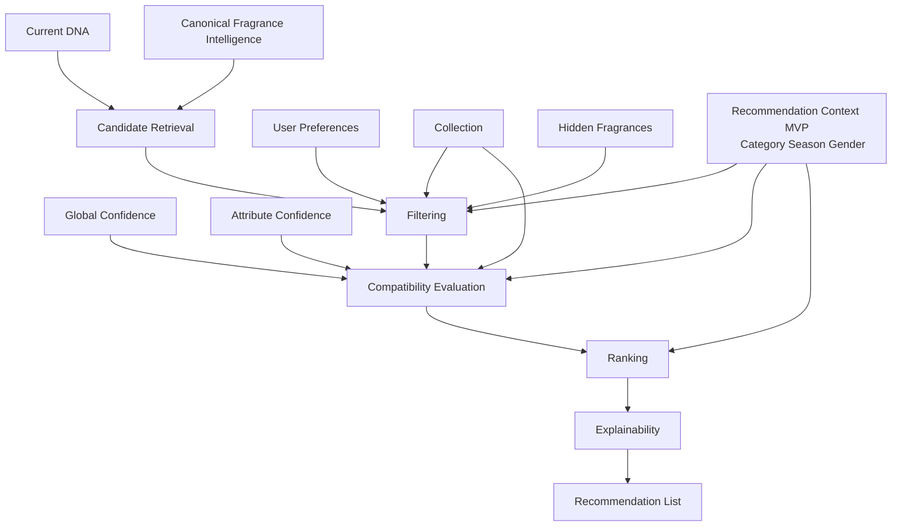

# Recommendation Engine

## Purpose
Define the canonical architecture for how FragranceDNA transforms completed user intelligence into fragrance recommendations.

## Owner
Recommendation Intelligence Team.

## Dependencies
PRODUCT_DOCTRINE.md, ARCHITECTURE_PRINCIPLES.md, CANONICAL_ARCHITECTURE_V2.md, USER_DNA_MODEL.md, FRAGRANCE_INTELLIGENCE_MODEL.md, EXPLAINABILITY.md, ENGINE_VERSIONING.md.

## Canonical Responsibility
Transform Current DNA into the best possible fragrance recommendations using canonical user intelligence, canonical fragrance intelligence, and temporary recommendation-session context.

## Mission
The Recommendation Engine has one responsibility only:
transform completed Current DNA into recommendation outputs.

It does not perform grounding, testing, learning-source orchestration, confidence generation, or DNA fusion.
Those responsibilities belong to the Discovery Engine and User Intelligence systems.

Recommendation Engine starts only after Current DNA already exists.

## Canonical Design Principle
Recommendation Engine must optimize for the best fragrances for the user's DNA.

It must not optimize for maximum diversity.
It must not penalize similar fragrances merely because the user already owns fragrances from the same olfactory family.

Collection awareness exists to provide context, explainability, and optional filtering.
Similarity is not redundancy.
Only explicit clone relationships or near-identical duplicate products may justify informational warnings or optional exclusion behavior.

Recommendation Engine receives two independent inputs:
1. Current User DNA
2. Recommendation Context

Recommendation Context is temporary session intent.
It is not part of Persistent User DNA and must never modify, redefine, or influence the user's learned olfactory profile.

## Responsibilities
1. Consume canonical user intelligence.
2. Consume canonical fragrance intelligence.
3. Respect explicit user states and recommendation constraints.
4. Retrieve eligible recommendation candidates.
5. Filter ineligible candidates before ranking.
6. Evaluate candidate compatibility against the current user profile.
7. Rank eligible candidates for the active recommendation session context.
8. Produce explainable and reproducible recommendation outputs.

## Canonical Inputs
Recommendation Engine operates on conceptual inputs only.
This document does not define database fields or storage schema.

Recommendation Engine consumes two independent input families:
1. Persistent user intelligence
2. Recommendation Context

These two input families must remain architecturally separate.

### 1. Current DNA
Current DNA is the canonical user preference intelligence consumed by recommendation logic.
It is the fused, confidence-aware profile representing the user's current olfactory preference structure.

### 2. Global Confidence
Global Confidence expresses overall confidence in the quality and stability of the user's current intelligence.
It informs how strongly the engine can trust broad profile conclusions.

### 3. Attribute Confidence
Attribute Confidence expresses confidence at finer behavioral surfaces, such as canonical attributes or other supported recommendation features.
It informs how confidently the engine should rely on specific learned signals.

### 4. User Preferences
User Preferences include persistent user states that affect recommendation eligibility or desirability.
Examples include liked, disliked, rejected, hidden, favorites, and related preference states that are distinct from collection ownership.

### 5. Collection
Collection is the user's known fragrance library and ownership-related state.
It includes owned items, wishlist state, and collection membership signals that may affect recommendation context, filtering, and explainability.

### 6. Hidden Fragrances
Hidden Fragrances are candidates the user has explicitly chosen not to surface in recommendation outputs.
These must be respected before ranking.

### 7. Recommendation Context
Recommendation Context is the temporary intent definition for the current recommendation session.
It shapes recommendation suitability without mutating, enriching, or redefining Persistent User DNA.

### MVP Context Profile (Current Implementation)
For the current implementation, Recommendation Context includes only fields that are fully supported by the current FragranceDNA data model.

MVP Recommendation Context fields:
1. Fragrance Category
2. Season
3. Gender Direction

Canonical allowed values in MVP:
1. Fragrance Category: Any, Designer, Niche, Dupe
2. Season: Any, Spring, Summer, Autumn, Winter
3. Gender Direction: Leaning Feminine, Unisex, Leaning Masculine

Recommendation Context should influence filtering and ranking, but it must never redefine the user's DNA.

### Extension-Ready Context Model
The Recommendation Context model must remain extension-ready.
Future context fields may be added without architectural redesign when canonical metadata support is available.

Not implemented in the current MVP context:
1. Recommendation Objective
2. Budget
3. Availability Preferences
4. Price filters

These concepts become active recommendation-context fields only after canonical fragrance metadata support is available in the Master Perfume Database.

Recommendation Context may later include other temporary serving inputs such as occasion, weather, region, time-of-day, or wardrobe intent when supported.

### 8. Runtime Serving Context
Runtime Serving Context includes any additional temporary serving constraints used during the current recommendation session.
It follows the same non-mutating rule as Recommendation Context and must remain separate from Persistent User DNA.
In the current MVP recommendation implementation, no additional runtime context dimensions are active beyond the MVP Context Profile.

### 9. Canonical Fragrance Intelligence
Recommendation Engine consumes only Canonical Fragrance Intelligence.
It must never consume raw provider schemas directly.

Canonical Fragrance Intelligence conceptually includes:
1. canonical fragrance identity
2. canonical attributes and axis mapping
3. confidence and evidence metadata
4. version lineage
5. provider-agnostic fragrance facts relevant to recommendation

## Canonical Outputs
Recommendation Engine returns recommendation outputs, not learning outputs.

Each recommendation must conceptually expose:

### 1. Compatibility Score
A normalized recommendation compatibility signal representing how appropriate the candidate is for the current recommendation context and current user state.

### 2. Explainability
A recommendation-specific explanation payload derived from actual decision inputs and ranking logic.

### 3. Confidence
A recommendation confidence signal expressing how reliable the engine believes the recommendation is for this user and this objective.

### 4. Recommendation Reasons
A structured set of reasons describing why the candidate was selected.
Reasons must be traceable to actual intelligence inputs and decision stages.

### 5. Warnings
Warnings capture important caveats or risk signals relevant to the recommendation.
Examples may include low-confidence fit, explicit clone or near-duplicate overlap, missing data, or objective mismatch concerns.

### 6. Recommendation List
The final output is an ordered list of recommendation results produced for a specific objective and context.

## Pipeline
Recommendation Engine is a staged decision pipeline.
Each stage has a distinct responsibility.

### Pipeline Overview
Current DNA

↓

Candidate Retrieval

↓

Filtering

↓

Compatibility Evaluation

↓

Ranking

↓

Explainability

↓

Recommendation List

### 1. Candidate Retrieval
Candidate Retrieval identifies the set of possible recommendation candidates from Canonical Fragrance Intelligence before user-specific exclusion and ranking are applied.

Responsibility:
define the eligible search universe for the current recommendation task.

Candidate Retrieval must not use raw provider schemas and must not depend on Adaptive Test internals.

### 2. Filtering
Filtering removes candidates that should not proceed to recommendation evaluation for the current user, explicit constraints, or active recommendation session context.

Responsibility:
apply hard eligibility constraints before ranking.

Filtering happens before ranking so that ineligible items do not distort recommendation outcomes.
Whenever possible, context should act as a ranking preference rather than a hard exclusion rule.
Hard filtering should be reserved for explicit user constraints and explicit ineligibility conditions.

### 3. Compatibility Evaluation
Compatibility Evaluation assesses how suitable each remaining candidate is for the current user profile and recommendation context.

Responsibility:
measure candidate fit against Current DNA, confidence-aware profile signals, user states, collection awareness, recommendation context, and runtime serving context.

This stage defines the conceptual compatibility judgment surface, not a specific formula.
Compatibility Evaluation must optimize for user-DNA fit rather than for artificial diversity across the user's existing collection.

### 4. Ranking
Ranking orders eligible candidates according to recommendation suitability for the active objective.

Responsibility:
produce the best ordered candidate list from already filtered and evaluated candidates.

Ranking may consider compatibility, confidence, context fit, collection awareness, runtime context, and other canonical recommendation factors.
This document does not define ranking formulas.
Ranking must not demote a highly compatible fragrance solely because it is similar to fragrances the user already owns, unless an explicit filtering or warning policy for clone or near-duplicate products applies.
Recommendation Context should influence ranking whenever possible without being allowed to rewrite Persistent User DNA.

### 5. Explainability
Explainability converts the actual recommendation decision path into a structured explanation contract.

Responsibility:
ensure every surfaced recommendation is understandable, traceable, and reproducible.

Explainability is a required output stage, not an optional decoration.

### 6. Recommendation List
Recommendation List is the final ordered set of surfaced recommendations.

Responsibility:
deliver the explainable, filtered, ranked recommendation output for the current recommendation context.

## Filtering
Recommendation Engine must support filtering before ranking.
This document defines filtering responsibilities only, not filtering implementation.

### Filtering Responsibilities
1. Exclude hidden fragrances.
2. Exclude already owned fragrances when the active recommendation session rule or serving policy requires it.
3. Respect collection rules.
4. Respect brand-positioning constraints such as designer, niche, or dupe preference.
5. Respect season constraints when explicitly requested.
6. Respect gender-direction constraints when explicitly requested.
7. Respect user-specific exclusion states and explicit ineligibility rules.

Filtering must not treat broad olfactory similarity as automatic ineligibility.
Similarity to owned fragrances may inform explainability or optional policy-driven exclusions only when the relationship is an explicit clone or near-identical duplicate condition.
Filtering should prefer context-sensitive ranking adjustments over exclusion whenever the active session input is a soft preference rather than an explicit hard constraint.

### Example Filtering Dimensions
1. Designer
2. Niche
3. Dupe
4. Season
5. Gender Direction
6. Hidden Fragrances
7. Already Owned
8. Collection Rules

Filtering is responsible for eligibility, not desirability scoring.

### Hard Constraint Rule
Hard filtering should be reserved for explicit user constraints.
Examples include:
1. Niche only
2. Designer only
3. Dupe only
4. Specific season only
5. Specific gender direction only
6. Explicit hidden-fragrance exclusions

Soft Recommendation Context preferences should influence ranking before they trigger exclusion whenever the request semantics allow it.

## Collection Awareness
Recommendation Engine must be collection-aware.

Collection Awareness exists to provide recommendation context, explainability, and objective-sensitive filtering while preserving the primacy of DNA fit.

### Collection Awareness Responsibilities
1. Recognize what the user already owns.
2. Distinguish between broad similarity and true duplication.
3. Recognize explicit clone relationships or near-identical duplicate products when relevant.
4. Recognize when the correct recommendation depends on collection strategy rather than pure profile fit.
5. Remain compatible with future recommendation objectives that may depend on collection state, such as collection expansion or gap-filling.

Collection Awareness must not introduce a default diversity penalty.
Collection Awareness enriches recommendation logic, but does not rewrite DNA and does not override strong DNA fit merely because a candidate belongs to a familiar olfactory family.

## Explainability
Recommendation outputs must be explainable.

### Explainability Contract
Every surfaced recommendation must be able to provide:
1. the active recommendation context
2. the relevant user-intelligence inputs used by the recommendation decision
3. the relevant collection and preference constraints applied before or during ranking
4. positive reasons for inclusion
5. negative factors, trade-offs, or caveats when relevant
6. enough version and trace information to reconstruct the decision path

When collection context affects a recommendation, explainability must distinguish clearly between:
1. familiar olfactory alignment that supports recommendation quality
2. explicit clone or near-duplicate concerns that may justify a warning or optional exclusion

When Recommendation Context affects a recommendation, explainability must distinguish clearly between:
1. long-term DNA fit
2. temporary session context preferences or constraints

### Explainability Rules
1. Explanations must derive from actual decision inputs and actual decision stages.
2. Explanations must be reproducible.
3. Explanations must not invent unsupported rationale.
4. Hidden or excluded fragrances may require exclusion rationale in internal traces even if not shown in the user-facing payload.

## Versioning
Recommendation Engine is a versioned intelligence system.

### Versioned Areas
At minimum, the following recommendation components are conceptually versioned:
1. compatibility model
2. ranking model
3. explainability model
4. filtering policy
5. context policy
6. fragrance intelligence snapshot lineage
7. user intelligence snapshot lineage

### Versioning Responsibility
Recommendation outputs must preserve enough version context to support reproducibility, safe evolution, and historical reconstruction of prior decisions.

## Out of Scope
This document does not define:
1. recommendation formulas
2. ranking formulas
3. similarity formulas
4. database schema
5. builders
6. knowledge base design
7. translation engine design
8. UI behavior
9. implementation-specific service boundaries
10. discovery, testing, confidence generation, or DNA fusion behavior

## Future Extensions
The Recommendation Engine may evolve without violating this specification if it preserves canonical boundaries and explainability.

Examples of future extension areas include:
1. recommendation objectives
2. budget-aware recommendation context
3. availability-aware recommendation context
4. price-aware filtering
5. stronger collection coverage reasoning
6. improved confidence-aware ranking behavior
7. richer warning taxonomy
8. more expressive explainability payloads
9. more refined filtering policies

Future extensions must not move Discovery Engine responsibilities into Recommendation Engine.

## Architecture Diagram

## Summary
Recommendation Engine is the canonical consumer of completed user intelligence for fragrance recommendation.
Its responsibility begins after Current DNA exists and ends with an explainable, reproducible recommendation list.
It must remain objective-driven, collection-aware, filter-first, DNA-fit-first, context-aware, and strictly separated from Discovery Engine responsibilities.